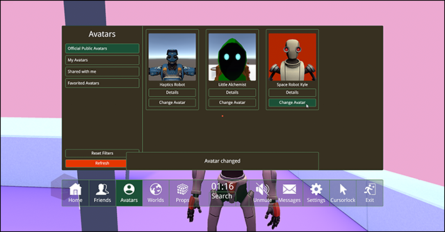

# Avatar Change Info
This mod shows simple main menu popup upon local player avatar change and prop spawn.

# Installation
* Install [latest MelonLoader](https://github.com/LavaGang/MelonLoader)
* Get [latest release DLL](../../../releases/latest):
  * Put `ml_aci.dll` in `Mods` folder of game
