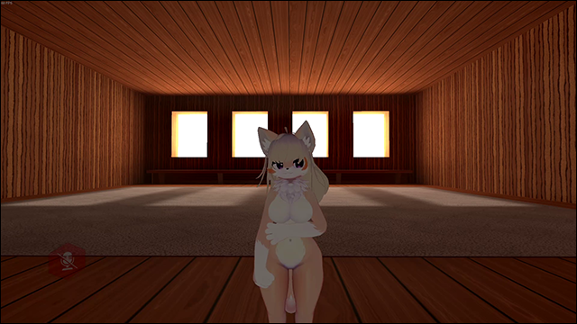

# Desktop Head Tracking
This mod adds desktop head tracking based on data from memory-mapped file `head/data`.  
Refer to `TrackingData.cs` for reference in case of implementing own software.

# Features
* Head rotation
* Eyes gaze direction
* Basic mouth shapes: open, smile and pout
* Blinking

# Installation
* Install [latest MelonLoader](https://github.com/LavaGang/MelonLoader)
* Get [latest release DLL](../../../releases/latest):
  * Put `DesktopHeadTracking.dll` in `Mods` folder of game

# Usage
Available mod's settings in `Settings - Implementation - Desktop Head Tracking`:
* **Enabled:** enables mod's activity; default value - `false`.
* **Use head tracking:** enables head tracking; default value - `true`.
* **Use eyes tracking:** enables eyes tracking; default value - `true`.
* **Use face tracking:** enables mouth shapes tracking; default value - `true`.
  * **Note:** Your avatar should have configured `CVR Face Tracking` component.
* **Use blinking:** uses blinking from data; default value - `true`.
* **Mirrored movement:** mirrors movement and gaze along 0YZ plane; default value - `false`.
* **Movement smoothing:** smoothing factor between new and old movement data; default value - `50`.

# Known compatible tracking software
* [VSeeFace](https://www.vseeface.icu) with [Tracking Data Parser mod](https://github.com/SDraw/ml_mods_vsf)
