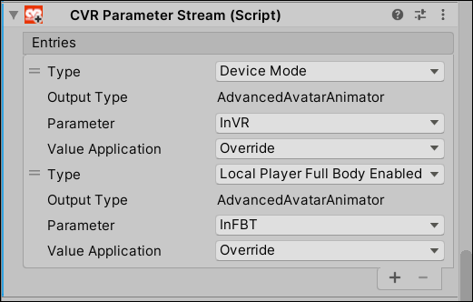
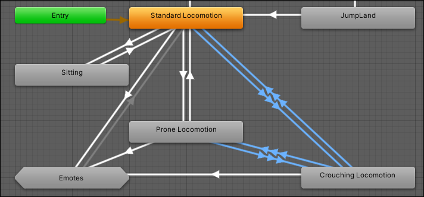
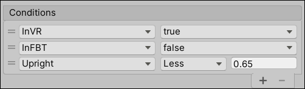
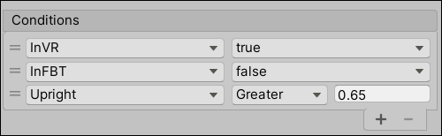
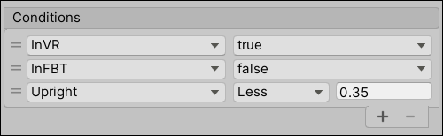
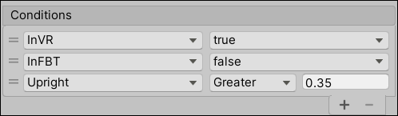
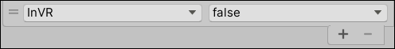

# Avatar Motion Tweaker
This mod adds features for AAS animator and avatar locomotion behaviour.

# Installation
* Install [latest MelonLoader](https://github.com/LavaGang/MelonLoader)
* Get [latest release DLL](../../../releases/latest):
  * Put `ml_amt.dll` in `Mods` folder of game

# Usage
Available mod's settings in `Settings - Implementation - Avatar Motion Tweaker`:
* **IK locomotion override:** disables legs locomotion/autostep upon HMD reaching height of `CrouchLimit`; default value - `true`.
* **Crouch limit:** defines first limit; default value - `65`.
  * Note: Can be overrided by avatar. For this avatar has to have child gameobject with name `CrouchLimit`, its Y-axis location will be used as limit, should be in range [0.0, 1.0].
* **Detect pose (regular avatars):** forces regular avatars' animations to transit to crouching/proning animation states; default value - `true`.
  * Note: Avatar is considered as regular if its animator doesn't have `Upright` parameter.
* **Prone limit (regular avatars):** defines second limit; default value - `30`.
  * Note: Can be overrided by avatar. For this avatar has to have child gameobject with name `ProneLimit`, its Y-axis location will be used as limit, should be in range [0.0, 1.0].
  * Note: Has no effect for mod compatible avatars.

Available additional parameters for AAS animator:
* **`Upright`:** defines linear coefficient between current viewpoint height and avatar's viewpoint height. Range - [0.0,1.0] (0.0 - floor, 1.0 - full standing).
  * Note: Can be set as local-only (not synced) if starts with `#` character.
  * Note: Defining this parameter in AAS animator will consider avatar as compatible with mod.

Additional avatars tweaks:
* If avatar has child object with name `LocomotionOffset` its local position will be used for offsetting VRIK locomotion center.

## Advanced usage in AAS animator for mixed desktop and VR
* To differentiate between desktop and VR players use `CVR Parameter Stream` component on avatar's root gameobject. As example, `InVR` and `InFBT` are boolean typed animator parameters:  

* Add additional transitions between standing, crouching and proning blend trees:  

* Add conditions for new VR transitions:  
  * Standing -> Crouching:  
  
  * Crouching -> Standing:  
  
  * Crouching -> Proning:  
  
  * Proning -> Crouching:  
  
* Add condition check for all desktop transitions:  

  
# Notes
* Usage of `Upright` parameter for transition between poses (standing/crouching/proning) in desktop mode is useless, because in this case your animations are updating value of `Upright` parameter, not the other way around.
* Please, keep your avatar root object at identity scale. Thank you.