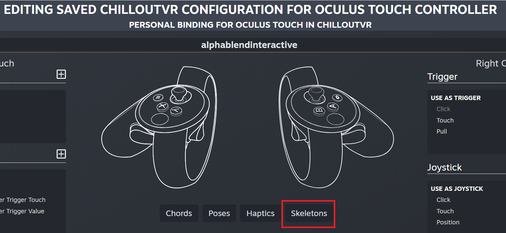

# Better Fingers Tracking
Mod that overhauls behaviour of fingers tracking.

# Installation
* Install [latest MelonLoader](https://github.com/LavaGang/MelonLoader)
* Get [latest release DLL](../../../releases/latest):
  * Put `BetterFingersTracking.dll` in `Mods` folder of game
  
# Usage
Available mod's settings in `Settings - Input & Key-Bindings - Better Fingers Tracking`:
* **Force SteamVR skeletal input:** forced usage of SteamVR skeletal input (works as long as controllers' driver supplies skeletal pose throught OpenVR interfaces); `false` by default
* **Motion range:** fingers tracking motion range/mode/type; `With controller` by default
* **Filter humanoid limits:** Limits fingers rotations to be valid for Unity's Mechanim; `true` by default
  * Note: Enabling this option ensures that visual representation of your fingers will be same for you and remote players, but it cancels out additional finger segments rotations that can be better visually in most cases.
* **Show hands model:** shows transparent hands model (mostly as debug option); `false` by default
* **Change fingers direction at bind:** tries to allign avatar's fingers for more accurate poses

# Notes
* Currently supports only SteamVR environment, OpenXR support is planned.
* Fingers tracking quality is highly dependant on avatar's hand state in Unity's T-pose, possible solutions are in search.
* For Oculus Quest controllers (all versions) be sure that skeleton bindings are properly set up in SteamVR controllers bindings.
<kbd></kbd>
