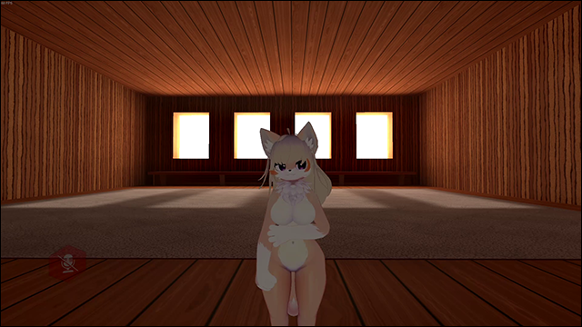

# Desktop Head Tracking
This mod adds desktop head tracking based on data from memory-mapped file `head/data`.  
Refer to `TrackingData.cs` for reference in case of implementing own software.

# Features
* Head rotation
* Eyes gaze direction
* Blinking

# Installation
* Install [latest MelonLoader](https://github.com/LavaGang/MelonLoader)
* Get [latest release DLL](../../../releases/latest):
  * Put `ml_dht.dll` in `Mods` folder of game

# Usage
Available mod's settings in `Settings - Implementation - Desktop Head Tracking`:
* **Enabled:** enabled head tracking; default value - `false`.
* **Mirrored movement:** mirrors movement and gaze along 0YZ plane; default value - `false`.
* **Movement smoothing:** smoothing factor between new and old movement data; default value - `50`;

# Known compatible tracking software
* VSeeFace with [Tracking Data Parser mod](https://github.com/SDraw/ml_mods_vsf)

# Notes
* Blinking doesn't work for remote players to due [game's bug](https://feedback.abinteractive.net/p/overrided-blinking-state-isn-t-copied-to-movement-data-from-network).
