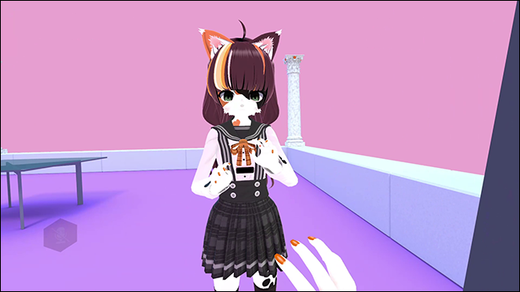

# Leap Motion Extension
This mod allows you to use your Leap Motion controller for hands and fingers tracking.

# Installation
* Install [latest Ultraleap Gemini tracking software](https://developer.leapmotion.com/tracking-software-download)
* Install [latest MelonLoader](https://github.com/LavaGang/MelonLoader)
* Get [latest release DLL](../../../releases/latest):
  * Put `ml_lme.dll` in `Mods` folder of game

# Usage
## Settings
Available mod's settings in `Settings - Implementation - Leap Motion Tracking`:
* **Enable tracking:** enables/disables hands tracking from Leap Motion data, disabled by default.
* **Tracking mode:** sets Leap Motion tracking mode, available values: `Screentop`, `Desktop` (by default), `HMD`.
* **Desktop offset X/Y/Z:** offset position for body attachment, (0, -45, 30) by default.
* **Attach to head:** attaches hands transformation to head instead of body, disabled by default.
* **Head offset X/Y/Z:** offset position for head attachment (`Attach to head` is **`true`**), (0, -30, 15) by default.
* **Offset angle X/Y/X:** rotation around specific axis, useful for neck mounts, 0 by default.
* **Track elbows:** elbows tracking, works best in `Screentop` and `HMD` tracking modes, `true` by default.
* **Fingers tracking only:** applies only fingers tracking, disabled by default.
* **Model visibility:** shows Leap Motion controller model, useful for tracking visualizing, disabled by default.
* **Visualize hands:** shows overlayed hands model, disabled by default.
* **Interaction input:** enables in-game interactions (props, menu and etc.); `true` by default.
* **Interact gesture threadhold:** activation limit for interaction based on hand gesture; 80 by default.
* **Grip gesture threadhold:** activation limit for grip based on hand gesture; 40 by default.
