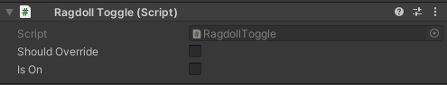

# Player Ragdoll Mod
This mod turns player's avatar into ragdoll puppet.

# Installation
* Install [latest MelonLoader](https://github.com/LavaGang/MelonLoader)
* Get [latest release DLL](../../../releases/latest):
  * Put `ml_prm.dll` in `Mods` folder of game
  
# Usage
* Press `R` to turn into ragdoll and back.

Optional mod's settings page with [BTKUILib](https://github.com/BTK-Development/BTKUILib):
* **Switch ragdoll:** turns into ragdoll state and back, made for VR usage primarily.
* **Use hotkey:** enables/disables ragdoll state switch with `R` key; `true` by default.
* **Use gravity:** enables/disables gravity for ragdoll; `true` by default.
  * Note: Forcibly enabled in worlds that don't allow flight.
* **Pointers reaction:** enables ragdoll state when player collides with trigger colliders with CVRPointer component of `ragdoll` type (avatars, props and world included); `true` by default.
* **Ignore local pointers:** enables/disables ignoring of CVRPointer components of `ragdoll` type on local player's avatar; `true` by default.
* **Combat reaction:** enables ragdoll state upon death in worlds with combat system; `true` by default.
* **Auto recover:** enables automatic recovering after specific time delay; `false` by default.
* **Slipperiness:** enables/disable low friction of ragdoll; `false` by default.
  * Note: Forcibly disabled in worlds that don't allow flight.
* **Bounciness:** enables/disable bounce force of ragdoll; `false` by default.
  * Note: Forcibly disabled in worlds that don't allow flight.
* **View direction velocity:** apply velocity to camera view direction instead of player movement direction; `false` by default.
  * Note: Forcibly disabled in worlds that don't allow flight.
* **Jump recover:** enables recovering from ragdoll state by jumping; `false` by default.
* **Velocity multiplier:** velocity force multiplier based on player's movement direction; `2.0` by default.
  * Note: Limited according to world's fly multiplier.
  * Note: Forcibly set to `1.0` in worlds that don't allow flight.
* **Movement drag:** movement resistance; `2.0` by default.
  * Note: Forcibly set to `1.0` in worlds that don't allow flight.
* **Angular movement drag:** angular movement resistance; `2.0` by default.
* **Recover delay:** time delay for enabled `Auto recover` in seconds; `3.0` by default.
* **Reset settings:** resets mod settings to default.

Available additional parameters for AAS animator:
* **`Ragdolled`:** defines current ragdoll state; boolean.
  * Note: Can be set as local-only (not synced) if starts with `#` character.

# Unity Editor Script
You can also trigger the ragdoll via animations on your avatar. To do this you need:
* Download and import the `ml_prm_editor_script.unitypackage` into your unity project
* Add the component `Ragdoll Toggle` anywhere inside of your avatar's hierarchy.

Now you can animate both parameters available:
- **Should Override:** whether the animation should override the toggled state of the ragdoll.
- **Is On:** whether the ragdoll state is On or Off (only works if `Should Override` is also On).

  
Note: In order to work the game object needs to be active and the component enabled.

# Mods Integration
You can use this mod's functions within your mod. To do this you need:
* Add mod's dll as reference in your project
* Access ragdoll controller with `ml_prm.RagdollController.Instance`

Available methods:
* ```bool IsRagdolled()```
* ```void SwitchRagdoll()```

# Notes
* If ragdoll state is enabled during emote, remote players see whole emote playing while local player sees ragdolling. It's tied to how game handles remote players, currently can be prevented with (choose one):
  * Renaming avatar emote animations to not have default name or containing `Emote` substring.
  * Holding any movement key right after activating ragdoll state.
